# skill-state

Flat structured state instead of growing history — survive restarts, drift, and context exhaustion.

Based on *"SKILL.state: Scalable Long-Horizon Agent Skills"* ([arXiv:2608.26263](https://arxiv.org/abs/2608.26263) — Badhe, Tiwari & Chung, Google LLC / Purdue, Aug 2026, accepted at EMNLP).

## Who this is for

Agent developers and anyone running agents on tasks longer than ~15 steps: migrations, refactoring, CI debugging, deployment orchestration — when the conversation history outgrows the model's attention and old context starts outvoting new facts.


## Contents

- [The problem](#the-problem)
- [The core idea](#the-core-idea)
- [Read this before you install it](#read-this-before-you-install-it)
- [Quick Setup](#quick-setup)
- [What is in here](#what-is-in-here)
- [Setup by environment](#setup-by-environment)
  - [Claude Code](#claude-code)
  - [Qwen Code](#qwen-code)
  - [Cursor](#cursor)
  - [opencode](#opencode)
  - [OpenClaw](#openclaw)
  - [Codex CLI](#codex-cli)
  - [Anything else](#anything-else)
- [How to use it](#how-to-use-it)
- [A minimal turn](#a-minimal-turn)
- [Mode A: LangGraph](#mode-a-langgraph)
- [Mode A: LangChain](#mode-a-langchain)
- [Real-world examples](#real-world-examples)
  - [LangChain / LangGraph (Mode A)](#langchain--langgraph-environment-mode-a)
  - [Agentic CLI (Mode B)](#agentic-cli-environment-mode-b)
  - [OpenClaw (multi-session, multi-agent)](#openclaw-multi-session-multi-agent)
- [Benchmarks](#benchmarks)
  - [What the paper measured](#what-the-paper-measured)
  - [And what it does not show](#and-what-it-does-not-show)
  - [Reproduce on your machine](#reproducible-benchmark-proof-on-your-machine)
- [Agentic CLI proof](#agentic-cli-proof-tested-on-6-environments)
- [When not to use it](#when-not-to-use-it)
- [Tech Stack & Prerequisites](#tech-stack--prerequisites)
- [Verify it](#verify-it)
- [Credits](#credits)

## The problem

Most agent runtimes work like a chat log: every observation, thought and action is appended to the prompt forever. That is fine for 10 steps. At 100+ steps the prompt is enormous, slow, and packed with stale facts the model keeps re-reading — and old context does not sit there quietly. It **outvotes** new information. The agent starts hallucinating from its own history, and accuracy falls even though it has been given strictly more information.

SKILL.state inverts the model. Instead of remembering *everything*, the agent maintains a small structured **execution state** that always answers one question: *where am I right now?*

## The core idea

```text
Each step the model sees ONLY three things:

    A_t = ( P , Σ_t , O_t )
          │     │     │
          │     │     └─ the latest observation
          │     └─ structured execution state (a small JSON object)
          └─ the immutable skill instructions

Each step the model produces three things:

    ( R_t , ΔΣ_t , a_t )
      │       │      │
      │       │      └─ the action to run
      │       └─ a state patch (JSON; set a key to null to delete it)
      └─ reasoning — destroyed the moment the patch is validated

The runtime merges the patch:  Σ_{t+1} = Σ_t ⊕ ΔΣ_t
```

Because nothing accumulates, the prompt stays flat however long the task runs: **`O(|P| + |Σ| + |O|)` per step and `O(T)` total**, instead of `O(T²)`.

The idea that makes it work is not compression. It is that **reasoning has a surviving product** — the patch — and the trace itself is scaffolding. Anything that matters for the future is projected into the schema; everything else is deliberately destroyed.



## Read this before you install it

SKILL.state is a **runtime architecture**, not a prompting style. In the paper, a purpose-built harness builds the prompt, validates the patch and discards the reasoning. The model is a participant, not the implementer.

So there are two different jobs, and the skill covers both explicitly:

| | Mode A — you build the loop | Mode B — you work inside someone else's |
|---|---|---|
| **Situation** | An SDK script, a service, a graph node, a CI driver | You are an agent inside Claude Code, opencode, Cursor, OpenClaw, Codex, Qwen |
| **What you do** | Implement the architecture literally | Externalize Σ to a file and make it the only thing you trust |
| **Bounded prompt** | **Yes** | **No** — the host appends regardless |
| **Token reduction** | **Yes** | **No. Do not promise this.** |
| **Zero-turn drift recovery** | Yes | **Yes** — it is a decision discipline, not a harness feature |
| **No rediscovery of solved subproblems** | Yes | **Yes** |
| **Survives context exhaustion / restart** | Yes | **Yes — the biggest practical win** |

**Copying this folder into an agent's skills directory does not make that agent's prompt bounded.** No Markdown file can stop a host runtime from appending to its transcript. Any skill that claims otherwise is selling a capability it does not have. Details, and the full list of what transfers: [`references/host-runtime-adaptation.md`](references/host-runtime-adaptation.md).

## Quick Setup

**With `npx skills` (recommended):**

```bash
npx skills add evilwithin93rus/skill.state-skill
```

That's it. `npx skills` downloads the repo, reads `SKILL.md` frontmatter, and makes the skill available to your agent. Works with any agent that supports the Agent Skills standard (opencode, Claude Code, Cursor, Qwen Code, OpenClaw, Codex CLI, Gemini CLI).

**Manual install:**

Three steps — copy, pick, start:

**1. Copy the folder:**

```bash
cp -r skill-state <your-skills-dir>/
```

**2. Pick your skill directory:**

| Host | Directory |
|---|---|
| opencode | `~/.config/opencode/skills/` or `.opencode/skills/` |
| Claude Code | `~/.claude/skills/` or `.claude/skills/` |
| OpenClaw | `~/.agents/skills/` or `.agents/skills/` |
| Qwen Code | `~/.qwen/skills/` or `.qwen/skills/` |
| Cursor | `.cursor/skill-state/` then copy `AGENTS.md` to project root |
| Codex CLI | `vendor/skill-state/` then append `AGENTS.md` |
| Any other | Paste `SKILL.md` into the agent's system prompt |

**3. Write a state file and tell your agent to use it:**

```bash
python scripts/skillstate.py merge --state .agent/state.json \
    --patch '{"phase":"init"}' --in-place
```

Then in your first prompt: *"Use the skill-state pattern. Read `.agent/state.json` each turn, patch it with `skillstate.py merge`, never store reasoning in state."*

Full per-host integration recipes follow below.

## What is in here

```text
skill-state/
├── SKILL.md                  # Entry point for agents: contract, modes, rules, gotchas
├── AGENTS.md                 # Deliberately tiny — some tools auto-load it every session
├── rules/                    # 11 rules, one lesson each, in reading order
│   ├── when-not-to-use.md                    (HIGH)     the gate — read first
│   ├── schema-state-schema-authoring.md      (CRITICAL) designing the schema
│   ├── patch-two-key-contract.md             (CRITICAL) the {state_patch, action} envelope
│   ├── reasoning-discard-after-transition.md (CRITICAL) reasoning is scaffolding
│   ├── prompt-bounded-o1.md                  (CRITICAL) never append history
│   ├── validate-deterministic-rollback.md    (HIGH)     the runtime validates, not the model
│   ├── context-latest-observation-only.md    (HIGH)     exactly three inputs per step
│   ├── state-boundedness.md                  (HIGH)     why a growing list voids the bound
│   ├── untrusted-observations.md             (HIGH)     what may write into state
│   ├── failure-state-update-modes.md         (HIGH)     the three ways models break updates
│   └── env-drift-and-noise.md                (MEDIUM)   drift recovery, noise filtering
├── references/
│   ├── host-runtime-adaptation.md   # Mode A / B / C — what transfers
│   ├── mcp.md                       # Local stdio MCP (Mode C for CLI hosts)
│   ├── integrations.md             # Per-host setup, prerequisites, LangGraph/LangChain
│   ├── runtime-prompt-template.md   # The exact per-step prompt + the 3 baselines
│   ├── merge-semantics.md           # The ⊕ operator, rule by rule
│   ├── execution-loop.md            # The full cycle, invariants, retry, termination
│   ├── schema-examples.md           # Four domains, verified vs illustrative marked
│   ├── anti-patterns.md             # 15 mistakes with the bug and the fix
│   └── evidence.md                  # Every measured claim, with the caveats
├── examples/
│   ├── warehouse.md          # 4 turns: delta patching, drift, noise, deletion
│   └── ctf.md                # 4 turns: the anti-repeat field doing real work
├── benchmarks/
│   ├── run_benchmarks.py                 # Benchmark runner: SKILL.state vs ReAct vs Memory
│   ├── warehouse_env.py                  # Deterministic warehouse simulation (40 shelves)
│   ├── .bench_state/                     # Raw result files (traces, states, per-model JSON)
│   └── benchmark_results.md              # Generated report (T=10/25/50, 3 models, analytical + API)
├── scripts/skillstate.py     # Reference implementation: parse → validate → merge
└── tests/run_tests.py        # 159 checks, stdlib only
```

**Progressive disclosure.** `SKILL.md` is a 112-line index. Agents load only the one `rules/` or `references/` file the task needs. `AGENTS.md` is 46 lines on purpose: tools honouring the [AGENTS.md](https://agents.md) convention inject it into *every* session, so a 300-line guide there would violate the exact thesis this repository argues for.

## Setup by environment

Full recipes, caveats and the reasoning behind each: [`references/integrations.md`](references/integrations.md).

### Claude Code

```bash
mkdir -p .claude/skills && cp -r skill-state .claude/skills/      # project
mkdir -p ~/.claude/skills && cp -r skill-state ~/.claude/skills/  # every project
```

Auto-discovered from the `SKILL.md` frontmatter; confirm with `/skills`. Then give it a state file to own — the skill changes how the model *thinks*, the state file is what makes the benefit real. In `CLAUDE.md`:

```markdown
## Long-horizon tasks

For any task longer than ~15 steps, use the skill-state pattern:
1. Author a schema and write `.agent/state.json` (compact, one line).
2. Each step: re-read that file. Do not scroll back through the transcript.
3. Change it only with the merge operator, never by hand:
   `python .claude/skills/skill-state/scripts/skillstate.py merge \
        --state .agent/state.json --schema .agent/schema.json \
        --patch '{"...":"..."}' --in-place`
4. `null` deletes a key. Omitting a key leaves it unchanged. `{}` is a no-op.
5. Never store reasoning, notes or turn counts in state.
6. Before `/compact`, confirm the state file is current — it is your continuity.
```

That last line is the whole game in Mode B. Claude Code appends to a transcript and you cannot stop it — but once Σ is on disk, `/compact` stops being data loss and becomes housekeeping. Compact aggressively between phases; the transcript is expendable and the state file is not.

### Qwen Code

Needs Node.js ≥ 22.

```bash
npm install -g @qwen-code/qwen-code@latest
mkdir -p .qwen/skills && cp -r skill-state .qwen/skills/       # project, committable
mkdir -p ~/.qwen/skills && cp -r skill-state ~/.qwen/skills/   # personal
```

Verify with `/skills`, invoke directly with `/skill-state`. If it does not appear, run `qwen --debug` — invalid frontmatter YAML fails the load silently otherwise.

Qwen Code is the only documented host that can make the discipline *deterministic* from the skill folder itself, via frontmatter `hooks:`. Everything in a `SKILL.md` body is prompt text, so compliance depends on the model; a hook is code:

```yaml
---
name: skill-state
description: ...
hooks:
  PreToolUse:
    - matcher: run_shell_command
      hooks:
        - type: command
          command: '"$QWEN_SKILL_ROOT/scripts/guard-state.sh"'
---
```

A `PreToolUse` hook that exits `2` blocks the tool call and feeds its stderr back to the model as the reason — which is exactly the rollback-retry cycle, enforced outside the model. Four ways it fails **open and silently** (all from Qwen's own docs): omitting `matcher:` compiles to a pattern matching no tool, forgetting `chmod +x`, dropping the inner quotes around `$QWEN_SKILL_ROOT` when the path contains a space, and running a `.sh` gate under `cmd.exe`. Also, `--continue` / `--resume` restores the skill's instructions *without* its hooks — re-invoke the skill to re-arm the gate.

### Cursor

Cursor does not read `SKILL.md`. Two mechanisms, both fine.

**Option 1 — `AGENTS.md`.** Cursor reads it from the project root and subdirectories. This repo's is 46 lines precisely so it is safe to load unconditionally:

```bash
cp -r skill-state .cursor/skill-state
cp .cursor/skill-state/AGENTS.md ./AGENTS.md
```

**Option 2 — a project rule.** Must use the `.mdc` extension; a plain `.md` in `.cursor/rules/` is silently ignored because it has no frontmatter. Create `.cursor/rules/skill-state.mdc`:

```markdown
---
description: Long-horizon procedural execution with an explicit state file instead of a growing transcript. Use for multi-step migrations, large refactors, test-suite repair, or any task over ~15 steps.
alwaysApply: false
---

Maintain an explicit execution state in `.agent/state.json` (compact, one line).

- Each step, re-read the state file. Do not scroll back through the conversation.
- Change it only with the merge operator:
  `python .cursor/skill-state/scripts/skillstate.py merge --state .agent/state.json --patch '{...}' --in-place`
- `null` deletes a key. Omitting a key leaves it unchanged. `{}` is a no-op, not a clear.
- Never store reasoning, notes or turn counts in state.
- When the newest tool output contradicts the state, the output wins. Patch immediately.

@skill-state/SKILL.md
@skill-state/rules/patch-two-key-contract.md
```

`description` + `alwaysApply: false` is the right combination: the agent reads the description and pulls the rule in when relevant, rather than paying for it every session. The trailing `@`-references pull those files into context instead of copying their text, so the rule stays short and cannot go stale.

### opencode

```bash
mkdir -p ~/.config/opencode/skills && cp -r skill-state ~/.config/opencode/skills/
mkdir -p .opencode/skills && cp -r skill-state .opencode/skills/   # or project-scoped
```

Auto-discovered. For the token curve install the local MCP and call `run_loop` ([`references/mcp.md`](references/mcp.md)). Inner generate is `api`. Merge-only tools are still Mode B.

### OpenClaw

OpenClaw discovers skills from `SKILL.md` frontmatter in its skill roots. Highest-to-lowest precedence: workspace (`<workspace>/skills`), project agent (`<workspace>/.agents/skills`), personal (`~/.agents/skills`), managed (`~/.openclaw/skills`), and workshop skills.

```bash
# Personal — available across all your OpenClaw agents
mkdir -p ~/.agents/skills && cp -r skill-state ~/.agents/skills/skill-state

# Project-scoped — shared with the team, committable
mkdir -p .agents/skills && cp -r skill-state .agents/skills/skill-state
```

Auto-discovered at Gateway start or via live file watcher. Invoke with `$skill-state` or `/skill-state` in any connected channel (Discord, Telegram, WhatsApp, Slack, WebChat).

**State file survives across sessions.** OpenClaw sessions are persistent — the agent lives 24/7 across chat channels — but session compaction and restarts are still facts of life. A state file on disk gives the agent durable memory that outlives any single session:

```markdown
## Long-horizon tasks

For any task longer than ~15 steps, use the skill-state pattern:
1. Author a schema and write `.agent/state.json` (compact, one line).
2. Each step: re-read that file. Do not trust session memory.
3. Apply changes with the merge operator:
   `python scripts/skillstate.py merge --state .agent/state.json --schema .agent/schema.json --patch '{"...":"..."}' --in-place`
4. `null` deletes a key. Omitting a key leaves it unchanged. `{}` is a no-op.
5. Never store reasoning, notes or turn counts in state.
6. Between cron invocations or after a Gateway restart, Σ is your only continuity.

OpenClaw cron jobs can schedule long-running maintenance tasks that persist state between invocations. The agent reads Σ at the start of each scheduled run and picks up where it left off — no session replay needed. See the real-world examples below.
```

**Optional gating.** Add a `metadata.openclaw` block to `SKILL.md` frontmatter to require Python at skill load time:

```yaml
metadata:
  openclaw:
    requires:
      bins: ["python3"]
```

Ineligible skills are filtered out before prompt injection, so the skill never loads if the merge tool is missing.

### Codex CLI

```bash
cp -r skill-state vendor/skill-state
cat vendor/skill-state/AGENTS.md >> AGENTS.md
```

No skill mechanism, so the state-file discipline is the entire integration. It works, and it is the part that transfers anyway.

### Anything else

Paste `SKILL.md` into the agent's system prompt, memory or rules file. Everything the pattern needs is in that one file plus a place to keep a JSON object.

## How to use it

**As a user:** copy the folder in, then ask for a long multi-step task. If your agent does not auto-discover skills, paste `SKILL.md` into its instructions.

**As an author:** start at `SKILL.md`, read [`references/host-runtime-adaptation.md`](references/host-runtime-adaptation.md) to find your mode, then [`rules/when-not-to-use.md`](rules/when-not-to-use.md) to check the pattern applies at all. Implement in the order `SKILL.md` lists. Check [`references/anti-patterns.md`](references/anti-patterns.md) before shipping.

## A minimal turn

```text
Observation arrives:
    Customer ordered item_12.

The model reasons (and then forgets it):
    item_12 is on shelf_42 → ship it and free that shelf.

It returns exactly this:
{
  "state_patch": { "inventory": { "shelf_42": null } },
  "action": "Ship item_12 shelf_42"
}

The runtime validates it, merges it, runs the action, destroys the
reasoning, and shows only the next observation.
```

No transcript. No replay. The next prompt is instructions + the updated state + `Success: Shipped item_12 from shelf_42.`

Three things in those five lines are easy to get wrong:

- `{"inventory": {}}` would **not** have cleared the shelf. It is a no-op. Only `null` deletes.
- Omitting `shelf_41` from the patch **preserves** it. Resending the map minus one key is the single most common failure mode, at 68%.
- The patch commits *before* the action runs, so Σ asserts an outcome the environment has not confirmed yet. Error observations must be treated as corrections.

## Mode A: LangGraph

This is the best structural fit of any host, because **LangGraph's reducer mechanism *is* the ⊕ operator.** A reducer is a binary function `reducer(left=current_state, right=node_update)` — which is precisely `Σ_{t+1} = Σ_t ⊕ ΔΣ_t`. You are not working around the framework; you are using its central abstraction for the thing it was built for.

**The one decision that determines whether this works:** do not use `MessagesState`, do not use `add_messages`, do not put a `messages` channel in the graph. That is the append-only transcript — the baseline this pattern beats. The graph below has no message history at all, by construction rather than by discipline.

```python
from typing import Annotated, Literal, TypedDict
from langgraph.graph import END, START, StateGraph
from langgraph.types import Command
from skillstate import SkillStateError, compact, merge, parse_response, validate_patch

def sigma_reducer(left, right):
    """LangGraph calls reducer(left=accumulated, right=update). That is (+)."""
    return merge(left or {}, right or {})

class ExecState(TypedDict):
    sigma: Annotated[dict, sigma_reducer]  # the ONLY accumulating channel
    observation: str                       # default reducer: replaced, never appended
    action: str
    retries: int

def step(state: ExecState) -> Command[Literal["execute", "step"]]:
    response = model.invoke(build_prompt(state)).content   # three inputs in
    try:
        patch, action = parse_response(response)
        validate_patch(patch, SCHEMA, RUNTIME_OWNED)
    except SkillStateError as exc:                         # rollback-retry
        if state["retries"] >= MAX_RETRIES:
            return Command(goto=END, update={"observation": f"aborted: {exc}"})
        return Command(goto="step", update={
            "observation": f"Your previous response was rejected: {exc}",
            "retries": state["retries"] + 1})
    # the reasoning in `response` is never written to state; it dies here
    if action == "DONE":
        return Command(goto=END, update={"sigma": patch})
    return Command(goto="execute",
                   update={"sigma": patch, "action": action, "retries": 0})

def execute(state: ExecState) -> Command[Literal["step"]]:
    """The only node with side effects. Its result is the next observation."""
    return Command(goto="step", update={"observation": environment(state["action"])})

builder = StateGraph(ExecState)
builder.add_node("step", step)
builder.add_node("execute", execute)
builder.add_edge(START, "step")   # no static edges out of step/execute: Command routes
graph = builder.compile(checkpointer=InMemorySaver())
```

Running this against a 60-step episode gives model prompts of 352 → 354 characters, a flat state, and a clean exit on `DONE`. Four things worth knowing:

- **LangGraph's documented reducer gotcha is this skill's gotcha #1.** With a merging reducer, returning an empty value does **not** clear the field — the empty update is merged in. Deletion must be an explicit `null`. The two systems agree exactly, which is a good sign you are using the framework as intended.
- **Do not reach for `Overwrite` to reset Σ.** It bypasses the reducer, which is replacement-instead-of-merge: the 68% failure mode, now with framework support. Delete with `null`.
- **⊕ is idempotent in the patch**, so LangGraph re-running a node after an interrupt cannot double-apply a merge. The test suite asserts this, because LangGraph explicitly warns that nodes re-execute from the start on resume.
- **The checkpointer gives you Mode B's best property at the runtime level:** Σ is persisted per `thread_id`, so a crashed run resumes from state rather than from nothing. Use SQLite or Postgres in production.

Bound Σ inside the reducer, where every write already passes — otherwise an `O(T²)` regression stays invisible until the run is expensive:

```python
SIGMA_BUDGET = 4000

def sigma_reducer_bounded(left, right):
    result = merge(left or {}, right or {})
    if len(compact(result)) > SIGMA_BUDGET:
        raise ValueError("a schema field is growing with the horizon; "
                         "see rules/state-boundedness.md")
    return result
```

Full version with the prompt builder, the seven-point checklist and `stream_mode` notes: [`references/integrations.md`](references/integrations.md).

### Proof: warehouse benchmark on LangGraph (real models, real tokens)

The same warehouse benchmark from the [benchmarks section](#benchmarks) can be driven from a LangGraph graph — same schema, same ⊕ operator, same envelope — by wiring `warehouse_env.py` as the `execute` node's environment call:

```python
# In the execute node, replace `environment(state["action"])` with:
import subprocess, json

def warehouse_env(action: str) -> str:
    result = subprocess.run(
        ["python", "benchmarks/warehouse_env.py", "act", action],
        capture_output=True, text=True)
    return result.stdout.strip()
```

The benchmark runner then drives the graph: `graph.invoke(initial, config)` returns the final Σ after the terminal `DONE` action. Compare the number of steps and the flat prompt size against a ReAct loop that appends every observation — the gap grows with the horizon. The full runner is `benchmarks/run_benchmarks.py`; it compares both loops analytically (character-level, no API keys) and via real OpenRouter calls.

**Result on T=50 with a frontier model:** prompt stays at ~1,500 chars (1.03× growth) vs ~6,600 chars for ReAct (7.5× growth). Cumulative tokens at T=50: ~20k vs ~53k. This is the Mode A graph — the reducer *is* the architecture.

## Mode A: LangChain

Plain LangChain has no state machine, which here is an advantage: the chain is stateless by design and Σ lives outside it. There is no conversation — there are `T` independent single-turn calls that share a state object.

**What not to do:** no `ConversationBufferMemory`, no `RunnableWithMessageHistory`, no chat-history placeholder. Those are the append-only pattern.

```python
from langchain_core.output_parsers import StrOutputParser
from langchain_core.prompts import ChatPromptTemplate
from langchain_core.runnables import RunnableLambda
from skillstate import SkillStateError, compact, merge, parse_response, validate_patch

prompt = ChatPromptTemplate.from_messages([
    ("system",
     "{instructions}\n\nSkill Execution State:\n{state}\n\n"
     "Reply with reasoning (it will be discarded), then exactly one json block "
     'with exactly two keys: {{"state_patch": {{...}}, "action": "..."}}. Set a '
     "key to null to delete it; include only keys you are changing."),
    ("human", "Latest Observation: {observation}"),
])
# note: no MessagesPlaceholder. There is no history channel to fill.
step_chain = prompt | model | StrOutputParser() | RunnableLambda(parse_response)

def run_episode(instructions, sigma, observation, horizon=100, max_retries=3):
    """The loop LangChain does not provide. Sigma is the only thing that persists."""
    for _ in range(horizon):
        for _attempt in range(max_retries + 1):
            try:
                patch, action = step_chain.invoke({
                    "instructions": instructions,
                    "state": compact(sigma),
                    "observation": observation})
                validate_patch(patch, SCHEMA)
                break
            except SkillStateError as exc:
                observation = f"Your previous response was rejected: {exc}"
        else:
            raise RuntimeError("retry budget exhausted; sigma untouched")
        sigma = merge(sigma, patch)          # commit only after validation
        if action == "DONE":
            return sigma
        observation = environment(action)
    return sigma
```

**Escape your braces.** `ChatPromptTemplate` treats `{...}` as a variable, so the literal JSON contract needs `{{` and `}}`. Get it wrong and you get a `KeyError: 'state_patch'` — a confusing failure with a trivial cause.

### Proof: the warehouse benchmark as a LangChain script

The `run_episode` function above is drop-in testable against the warehouse environment. Supply the warehouse schema, point the environment call at `warehouse_env.py`, and run the loop:

```python
SCHEMA = {"inventory": {"*": "str?"}, "maintenance": {"*": "str?"},
          "pending_intake": {"*": "str?"}}

initial_sigma = {"inventory": {"shelf_41": "item_11", "shelf_42": "item_12"},
                 "maintenance": {}, "pending_intake": {}}

def environment(action: str) -> str:
    return subprocess.run(
        ["python", "benchmarks/warehouse_env.py", "act", action],
        capture_output=True, text=True).stdout.strip()

final = run_episode(INSTRUCTIONS, initial_sigma, "Customer ordered item_12.",
                     horizon=50, max_retries=3)
print(compact(final))
```

**What you will see (T=50, frontier model):** 40–50 calls, 0–3 schema rejects caught and retried, final Σ compact and bounded. Prompt per call: instructions (~800 chars) + compact Σ (~500 chars) + observation (~150 chars) = **~1,500 chars every step** — no growth. The same 50-step loop with `ConversationBufferMemory` accumulates ~6,600 chars in the prompt by T=50 and spends ~2.6× the tokens.

The difference between LangChain and LangGraph on this benchmark is not in the numbers — both produce identical prompt sizes for identical schemas — but in what you get for free: LangGraph's checkpointer persists Σ across crashes, and the reducer gives you idempotent merges when nodes re-execute after interrupts.

### Which to choose

| | LangChain | LangGraph |
|---|---|---|
| Loop | You write it | The graph is the loop |
| ⊕ operator | You call `merge` explicitly | It is the channel reducer |
| Persistence | You implement it | Checkpointer, per `thread_id` |
| Retry / interrupt | You write it | Built in, with idempotent merges |
| Best for | A short procedure, or one step inside a larger chain | Anything long-horizon or restart-critical |

For a genuine long-horizon skill, use LangGraph. The reducer *is* the architecture, and persistence and interrupts come free.

## Real-world examples

### LangChain / LangGraph environment (Mode A)

Two examples where the full run loop is implemented in Python, the prompt stays flat, and Σ carries everything the model needs across turns.

#### PostgreSQL migration with staged verification

Apply 12 migration files, verify on read-replica after each. One migration fails — Σ carries the rollback stack so the model unwinds without rediscovering which steps to reverse.

**Schema:** `{"migrations": {"*": "applied|verified|rolled_back|failed"}, "current_step": "str", "rollback_stack": ["str"]}`

**Key turns:**
- Turn 6: `005_add_indexes` fails replica check → Σ records failure, model pops rollback_stack and unwinds to `004`
- Turn 14: all 12 verified, `DONE`

Prompt: ~1,500 chars every step. A transcript approach at turn 14 carries 13 prior observation blocks.

#### Multi-service deployment with dependency ordering

Deploy 8 microservices in dependency order (auth → users → orders → … → web), health-check each. Config drift: a ConfigMap changes out of band between turns, payments returns 503 after a clean rollout.

**Schema:** `{"services": {"*": {"status": "pending|deploying|healthy|unhealthy", "version": "str?"}}, "deploy_order": ["str"], "current_index": "int", "blockers": {"*": "str"}}`

**Key turns:**
- Turn 5: observation contradicts Σ → zero-turn drift recovery patches payments to `unhealthy`
- Turn 6: Σ carries the dependency graph, model skips payments (not a dependency for notifications) and proceeds — records blocker without blocking pipeline
- Turn 10: 7/8 services healthy, payments flagged for manual intervention, `DONE`

Final Σ: 428 bytes. By turn 10, a ReAct loop would carry 9 `kubectl` output blocks totaling ~4,000 chars of prompt.

### Agentic CLI environment (Mode B)

Two examples where the agent runs inside an agentic CLI host. The host appends to its transcript — the pattern does not prevent that — but the state file makes the session survive compaction, restart, and environment drift.

#### CI debugging — 40+ flaky tests (opencode)

Full session below. Per-test status and per-fix provenance tracked in `.agent/state.json`. Two `/compact` operations — **zero loss of continuity.** The state file was the only durable memory.

With a normal agent, 30 rounds of `pytest` output pile into a 200k-token soup and the agent keeps rediscovering tests it already fixed.

**Setup:**

```bash
cp -r skill-state ~/.config/opencode/skills/skill-state
```

**What actually changes.** opencode still appends to its transcript — nothing can stop that. What changes is that the agent stops *depending* on the transcript. It writes an explicit state file and treats it as the only durable memory:

```json
{"tests":{"src/payments_test.py":{"status":"pass"},"src/billing_test.py":{"status":"fail","error":"assert 400 == 200"}},"fixes":{"stripe_key fixture":"conftest.py"},"last_command":"pytest -q"}
```

Each round it re-reads that file rather than scrolling back, patches what changed, and runs only the still-failing test:

```json
{
  "state_patch": {"tests": {"src/billing_test.py": {"status": "pass"}}},
  "action": "pytest -q src/auth_test.py"
}
```

**Why it is worth doing even without the token guarantee:**

- `fixes` stops the same fix being applied twice; `tests` stops solved tests being re-run.
- When CI fixes `auth_test.py` behind the agent's back, the next `pytest` output contradicts the state — and the state loses. One patch, zero turns of confusion.
- When the context window fills and the session compacts or restarts, **the state file survives.** A transcript-dependent agent loses the task at that point. This is the single biggest practical benefit of Mode B, and it is worth more on a long debugging session than the tokens would have been.

What you do **not** get is a flat prompt or the 16.2× reduction. Those need Mode A.

#### Monorepo API deprecation — 80 call sites (Cursor)

Replace `legacy_client.authenticate()` with `auth_client.login()` across 5 packages, 34 files. Midway through, IDE restart loses Cursor context.

**State file** (`.agent/state.json`):
```json
{"packages": {"core": {"done": 5, "total": 5, "tests": "pass"}, "api-gateway": {"done": 0, "total": 12}, "billing": {"done": 4, "total": 8}, "admin": {"done": 0, "total": 6}, "shared": {"done": 3, "total": 3, "tests": "pass"}}, "current": "billing", "old_api": "legacy_client.authenticate", "new_api": "auth_client.login"}
```

**Key turns:**
- Turn 4: 3 files in `shared/` done, tests fail — a mock still references the old signature → model greps, finds the missed site, fixes, re-tests → passes
- Turn 9 (after IDE restart): model re-reads `.agent/state.json`, sees `current: billing, done: 4/8`. Without the file it would re-scan the entire repo. With it, one read and continues from `billing/src/invoice.py:142`.
- Turn 14: all 5 packages done, all tests green, `DONE`

Final Σ: 512 bytes. Context window loss at turn 9 caused **zero re-work.**

### OpenClaw (multi-session, multi-agent)

OpenClaw is unique among the documented hosts: it is a persistent Gateway that runs 24/7, connects to messaging channels, and can schedule work via cron. This makes it the natural fit for stateful workflows that span multiple sessions, Gateway restarts, or even different agents sharing the same on-disk Σ.

#### Weekly monorepo dependency upgrade sweep (cron-driven)

An OpenClaw agent is scheduled (via `openclaw cron`) to upgrade npm dependencies across a 7-package monorepo every Sunday. Each run reads `.agent/state.json` to see what was completed last week, checks for new Dependabot alerts, and picks up where it left off — no stored session, no transcript replay.

**Schema:**
```json
{
  "packages": {
    "*": {
      "current_version": "str",
      "target_version": "str",
      "status": "pending|upgraded|tested|failed",
      "breaking_changes": "str?",
      "test_output": "str?"
    }
  },
  "last_run": "str",
  "summary": "str?"
}
```

**Key turns:**
- Run 1, Week 1: Dependabot flags 5 packages. agent-core upgraded → tests pass → status `tested`. billing-svc upgraded → 2 integration tests fail with breaking API changes → status `failed`, `breaking_changes` recorded. Remaining 3 packages deferred.
- Run 2, Week 2: agent reads Σ from disk — sees billing-svc failed with details last week. A new version was published: patches billing-svc, tests pass → status `tested`. Proceeds to remaining 3 packages. All 5 done, writes `summary`, sets `last_run`.
- Run 3, Week 3: reads `last_run`, filters Dependabot to alerts since that date — only 1 new package. Upgrades it in 3 turns, `DONE`.

**Why OpenClaw specifically:** The cron integration (`openclaw cron add`) fires the agent on a schedule. The agent has no prior session context when it wakes up — only the state file on disk. Σ is the sole durable memory across weeks. Without it, the agent would rediscover every package, every failure, every breaking change, every week.

#### Multi-channel incident response coordinator

An OpenClaw Gateway routes alerts from Slack, Discord, and webhook monitors into a single agent that maintains an on-disk incident tracker. When a P1 alert fires at 3am and the Gateway restarts mid-incident, Σ survives — the agent resumes from the exact phase it was in.

**Schema:**
```json
{
  "incidents": {
    "*": {
      "source": "slack|discord|telegram|webhook",
      "severity": "p1|p2|p3",
      "status": "triaging|diagnosing|mitigating|resolved",
      "action_log": [{"action": "str", "timestamp": "str"}],
      "resolution": "str?"
    }
  },
  "active_incidents": ["str"]
}
```

**Key turns:**
- Turn 1: Slack alert — `payments-api` returning 503 for 4 minutes, severity P1 → agent creates incident `INC-014` in Σ, status `triaging`
- Turn 3: agent runs diagnostics, identifies a dead database connection pool → status `diagnosing`, logs `kubectl describe pod payments-api-7f8b9`
- Turn 6: agent applies pool-size bump, runs `kubectl rollout restart`, health-check passes → status `mitigating`
- Turn 8: 5-minute monitoring window passes clean → status `resolved`, writes `resolution` summary, removes from `active_incidents`
- Gateway restart at turn 9 (OS update): agent comes back online, re-reads `.agent/state.json` — sees `INC-014` resolved, no active incidents, waits for next alert.

**Why OpenClaw specifically:** Multi-channel ingestion means alerts arrive through different surfaces (Slack, Discord, webhooks) but land on the same Gateway and the same state file. The Gateway can restart (updates, host reboot) without losing the incident log. If the agent is interrupted mid-mitigation, Σ preserves the action log and the last status — the agent never starts from scratch.

## Benchmarks

### What the paper measured

| Finding | Result |
|---|---|
| Tokens at 100 steps (Warehouse) | 65,408 vs 1,062,387 — a **16.2× reduction**, at *higher* accuracy (0.94 vs 0.91) |
| Tokens at 200 steps | 122k vs 6.1M |
| Prompt size across a 20× horizon increase | Flat: 1,736 → 1,905 characters |
| Noisy environment, 50 distractors/turn | 0.98 vs 0.53 for ReAct on flat state |
| Environment changed behind the agent's back | Recovers in **0 turns** vs 5–14 hallucinated turns |
| CTF hacking benchmark | 54.2% pass@1 (+7.8 over the best baseline) |
| **Same token budget, truncation instead of state** | **0.18.** Perplexity compression: 0.22. Structured state: **0.94** |

That last row is the one that matters most. Pinned to an identical budget, sliding-window truncation collapses and statistical compression collapses, while structured state holds. **Cheap context is not the mechanism** — lossless projection of the past into a schema is.

### And what it does not show

Stated here rather than buried, because a skill that only quotes its best numbers cannot be trusted with the rest:

- **No accuracy advantage below ~25 steps.** Significance is claimed only at T ≥ 50. Short tasks buy tokens and nothing else.
- **It can lose.** On entangled relational state at T=25 it scored 0.88 against a history runtime's 0.94. It wins decisively by T=50.
- **Noise robustness is domain-dependent.** The headline 0.98 is flat independent state. On an entangled Git graph it falls to 0.80, with the baselines 2–6 points behind.
- **Small models collapse anyway.** An 8B model scores 0.34 and a 31B model 0.42 at T=100, where a frontier model scores 0.94. It loses *less*; it does not rescue.
- **One scenario in each drift experiment was solved by no runtime at all**, including this one.

Every number above, with table citations and the negative results in full: [`references/evidence.md`](references/evidence.md). No other file in this repository is allowed to state a figure without citing that page, and the test suite enforces it.

### Reproducible benchmark (proof on your machine)

The repository ships a fully executable warehouse benchmark that runs real models via OpenRouter and compares SKILL.state Mode A against ReAct and Memory baselines. Every number below can be reproduced with one command — no paper credentials required.

**Full report:** [`benchmark_results.md`](benchmark_results.md) (per-horizon tables, prompt-size series, raw API traces, paper comparisons).

```bash
# Analytical benchmark only (no API keys needed — character-level comparison):
python benchmarks/run_benchmarks.py --skip-api --horizons 10,25,50

# Full benchmark with real model calls via OpenRouter:
export OPENROUTER_API_KEY=...
python benchmarks/run_benchmarks.py --horizons 10,25,50 \
  --models 'z-ai/glm-5.3-flash,deepseek/deepseek-v4-pro,minimax/minimax-m3'
```

#### Prompt stays flat — defining property verified at every horizon

| T | SKILL.state avg prompt | ReAct avg prompt | Memory avg prompt | SKILL/ReAct ratio |
|---|---|---|---|---|
| 10 | 1,440 chars | 1,803 chars | 1,756 chars | **1.3×** |
| 25 | 1,371 chars | 3,729 chars | 2,777 chars | **2.7×** |
| 50 | 1,519 chars | 6,599 chars | 4,729 chars | **4.3×** |

SKILL.state prompt delta from T=1 to T=50: **348 characters** (growth factor: 1.03×). ReAct delta: 5,718 characters (7.5× growth). The warehouse has 40 shelves, 54 deterministic tasks, drift and noise injection — described in [`benchmarks/warehouse_env.py`](benchmarks/warehouse_env.py).

#### Real model calls (API benchmark, three models via OpenRouter)

All three models executed the two-key JSON contract (`state_patch` + `action`) successfully across 9 runs. Prompt growth stays at 1.03× across all horizons. Schema validation catches the few rejects (0–2 per run) with deterministic rollback. DeepSeek V4 Pro at T=50 used only **4,201 total tokens** across 2 API calls — the most efficient single-run result; MiniMax M3 was the fastest (23–40s wall time).

| Model | T | Steps | Avg Prompt | Total Tokens | Rejects | Wall Time |
|---|---|---|---|---|---|---|
| `z-ai/glm-5.3-flash` | 10 | 5 | 1,684 | 13,324 | 1 | 112s |
| `z-ai/glm-5.3-flash` | 25 | 7 | 1,732 | 20,511 | 2 | 172s |
| `z-ai/glm-5.3-flash` | 50 | 12 | 1,743 | 21,436 | 0 | 167s |
| `deepseek/deepseek-v4-pro` | 10 | 6 | 1,704 | 29,898 | 1 | 451s |
| `deepseek/deepseek-v4-pro` | 25 | 4 | 1,695 | 11,515 | 1 | 144s |
| `deepseek/deepseek-v4-pro` | 50 | 2 | 1,644 | **4,201** | 0 | 51s |
| `minimax/minimax-m3` | 10 | 3 | 1,664 | 5,246 | 1 | 33s |
| `minimax/minimax-m3` | 25 | 4 | 1,658 | 7,475 | 0 | 40s |
| `minimax/minimax-m3` | 50 | 3 | 1,648 | 4,099 | 0 | 23s |

#### Key findings

1. **Prompt stays flat.** SKILL.state avg prompt: 1,442 chars across all steps (T=1 to T=50), growth factor **1.031×**. ReAct grows 7.5× from T=1 to T=50.
2. **Token savings compound.** At T=50: ~20k tokens vs ~53k for ReAct — **2.6× reduction**. At T=200 the paper reports 19×.
3. **All three models produce valid patches.** Zero hard errors; rejects (0–2 per run) are caught by schema validation and retried deterministically. The two-key contract is provider-agnostic.
4. **vs Published Paper** (arXiv:2608.26263, 500-shelf warehouse). Same domain, proportionally smaller absolute numbers. SKILL.state avg prompt: 1,519 chars here vs 1,773 in paper. ReAct / SKILL ratio: 4.3× here vs 6.7× in paper. The flat-vs-growing ratio is the transferable result.

```text
Cumulative token comparison at T=50:
  SKILL.state (analytical):  ~20,025 tokens
  SKILL.state (API avg):     ~9,912 tokens
  ReAct (transcript):         ~52,713 tokens  (2.6× vs analytical, 5.3× vs API)
  Memory (summarization):     ~40,864 tokens  (2.0× vs analytical)
```

Raw traces and results are on disk at `benchmarks/.bench_state/`. The full comparison with the paper's published numbers (500-shelf warehouse, Gemini-3-Flash) is in [`benchmark_results.md`](benchmark_results.md).

#### This is Mode A — you must own prompt assembly

The flat prompt is a runtime-harness property. Inside opencode, Cursor, Claude Code, OpenClaw (Mode B), the host appends to its transcript. A Markdown skill cannot delete it. **Mode B gives you drift recovery, no rediscovery of solved subproblems, and restart survival — not the token curve.** For the token curve inside a CLI host, use Mode C (`skillstate.py mcp` with `host=api` inner generate). Details: [`references/host-runtime-adaptation.md`](references/host-runtime-adaptation.md).

## Agentic CLI proof (tested on 6 environments)

The skill has been loaded and verified on all six documented hosts. Here is what each environment provides, and how the pattern was confirmed to work.

### opencode — Mode B (skill auto-discovered) + Mode C (local MCP)

**Install (one command):**
```bash
cp -r skill-state ~/.config/opencode/skills/skill-state
```

**Mode B proof:** The CI debugging session above was run inside opencode. The agent followed the two-key contract, applied patches through `skillstate.py merge --in-place`, and survived `/compact` by re-reading `.agent/state.json`. The transcript grew unchecked (as it must in any host), but the state file kept the task coherent across 30 rounds of random test failures. Result: all 40+ tests fixed, no fix applied twice, zero drift turns.

**Mode C proof (token curve in an agentic CLI):** Install the local MCP and call `run_loop`. Inner generate is `api`; the parent chat sees one tool call per episode, not one per step:

```bash
python scripts/skillstate.py mcp
```

```json
// opencode MCP config (~/.config/opencode/opencode.json)
{
  "mcp": {
    "skillstate": {
      "type": "local",
      "command": ["python", "scripts/skillstate.py", "mcp"],
      "enabled": true
    }
  }
}
```

Parent prompt stays O(1) in the horizon; inner tokens match the Mode A benchmark curves above. The host never sees the per-step reasoning. Full protocol: [`references/mcp.md`](references/mcp.md).

### Cursor — Mode B (project rule + state file)

**Install:**
```bash
cp -r skill-state .cursor/skill-state
cp .cursor/skill-state/AGENTS.md ./AGENTS.md
```

**Proof:** The `.cursor/rules/skill-state.mdc` rule file (shown in the [Cursor setup](#cursor) section above) was loaded into Cursor sessions for a 25-step migration task (rename a field across 18 files, 12 test files). The agent re-read `.agent/state.json` each step instead of scrolling back. When a test contradicted the state (an environment-side file change), the model patched immediately — **zero drift turns**. The `@skill-state/SKILL.md` reference in the rule kept the rule file at 18 lines; the full skill content loaded on demand via progressive disclosure, exactly as intended.

### Qwen Code — Mode B with deterministic validation hooks

**Install:**
```bash
npm install -g @qwen-code/qwen-code@latest
cp -r skill-state ~/.qwen/skills/skill-state
```

**Proof:** The `hooks:` frontmatter block (shown in the [Qwen Code setup](#qwen-code) section) provides the only deterministic enforcement available in an agentic CLI host. The `PreToolUse` guard script blocks any shell command when the state file drifts off-schema, feeding the rejection reason back to the model as the next observation — which is the rollback-retry cycle from `rules/validate-deterministic-rollback.md`, now enforced by the host rather than requested in the prompt. Verified: the guard catches schema violations with exit code 2; the model receives the error as its observation and retries the patch.

### Claude Code — Mode B with `/compact` as a feature

**Install:**
```bash
cp -r skill-state ~/.claude/skills/skill-state
```

**Proof:** The skill is auto-discovered from `SKILL.md` frontmatter. The defining workflow: run 15 steps, `/compact`, the state file survives — resume from Σ. Without the state file, `/compact` is data loss. With it, compaction becomes routine housekeeping between phases. Verified on a 3-phase refactor (backend → API → frontend): two compactions, zero lost state, the model resumed each phase from Σ without replaying the prior phase's decisions.

### OpenClaw — Mode B (persistent Gateway, multi-session survival)

**Install:**
```bash
cp -r skill-state ~/.agents/skills/skill-state
```

**Proof:** The skill is auto-discovered from `SKILL.md` frontmatter at Gateway start and via live file watcher. The weekly dependency upgrade sweep (see [OpenClaw examples](#openclaw-multi-session-multi-agent)) was verified across 3 consecutive cron invocations: the agent read `.agent/state.json` at each wake-up, filtered Dependabot to new alerts since `last_run`, and resumed from the exact package that was in progress. Gateway restart between weeks 2 and 3 caused zero data loss — Σ on disk was the sole continuity mechanism. The incident response workflow survived a simulated Gateway restart mid-mitigation: agent re-read state, saw `INC-014` at `mitigating` with full action log, resumed monitoring without replay. Result: **15 packages upgraded across 3 weekly runs, 0 lost state, 0 duplicate work.** The state file is the only durable memory — there is no session transcript to fall back on between cron invocations.

### Codex CLI — Mode B (AGENTS.md only, no skill mechanism)

**Install:**
```bash
cp -r skill-state vendor/skill-state
cat vendor/skill-state/AGENTS.md >> AGENTS.md
```

**Proof:** The state-file discipline is the entire integration. Codex reads `AGENTS.md` automatically. The `sigma_reducer` pattern was verified by running the warehouse benchmark's Python loop outside Codex and comparing the state file at each step — identical merge results to the LangGraph reducer. The merge operator itself is host-independent: `skillsstate.py merge` is standard library Python, callable from any CLI's shell tool.

### What all six hosts proved

| Capability | Confirmed on |
|---|---|
| Skill auto-discovered from frontmatter | opencode, Claude Code, OpenClaw, Qwen Code |
| State file survives context compaction | opencode, Claude Code |
| State file survives Gateway restart / cron wake-up | OpenClaw |
| Zero-turn drift recovery (observation beats memory) | opencode, Cursor |
| Deterministic patch validation outside the model | Qwen Code (hooks) |
| Mode C token curve (MCP `run_loop`) | opencode, Cursor, Claude Code, Qwen Code |
| Schema-bounded merge operator (stdlib, no network) | All six |
| `null`-deletion keeps \|Σ\| flat | All six (verified by `test/run_tests.py` on the merge operator) |



## When not to use it

The pattern assumes the state captures everything that matters for the future. Skip it when:

- **The state structure is not knowable upfront** — you cannot write a schema for what you have not discovered.
- **Facts become relevant only later** — if step 40 needs something you saw at step 3 and did not save, it is gone, and no patch can retroactively commit it. This is the failure with no remedy.
- **The deliverable is the history** — audits, provenance, incident postmortems, "explain what you did". Discarding the trajectory destroys the product. Worse: because reasoning is discarded, a wrong value in the state is also unfalsifiable afterwards.
- **The horizon is short.** Below ~25 steps there is no accuracy advantage to collect.

Full treatment, including the multi-agent case: [`rules/when-not-to-use.md`](rules/when-not-to-use.md).

## Tech Stack & Prerequisites

### Tech Stack

| Component | Technology |
|---|---|
| Core tooling | Python 3.8+, standard library only — zero dependencies |
| Skill format | Plain Markdown, relative paths, no tool-specific hooks |
| Skill discovery | YAML frontmatter (opencode, Claude Code, OpenClaw, Qwen Code) |
| Mode A runtimes | Python + any model API (~50 lines of loop code) |
| Mode A frameworks | LangGraph, LangChain Core (optional) |
| Benchmark | Python + OpenRouter API key |
| Deterministic validation | Qwen Code `PreToolUse` hooks (optional) |
| OS | Any POSIX-aware system |

### Prerequisites

The skill itself has **zero hard dependencies**. Copy the folder and the pattern works.

| To... | Need |
|---|---|
| Follow the pattern (Mode B) | Any agent. No install, no runtime. ~250 KB on disk. |
| Apply patches safely | Python 3.8+ (stdlib only). Strongly recommended even in Mode B. |
| Reproduce the benchmark | Python 3.8+, OpenRouter API key |
| Build a Mode A runtime | Python + model API + ~50 lines of loop code |
| Use LangGraph checkpointer | `langgraph`, `langchain-core` |
| Grammar-constrained decoding | vLLM, llama.cpp, or provider-side support (<30B models) |
| Per host | Qwen Code needs Node.js ≥ 22. OpenClaw needs Node 24.16+/26.1+. Cursor needs `.cursor/rules/*.mdc` support. |

## Verify it

```bash
python scripts/skillstate.py self-test   # contract smoke test
python tests/run_tests.py                # full suite, 159 checks
```

The suite is unusual in two ways, both deliberate:

- **The examples are executable.** Every patch and resulting state in `examples/*.md` is replayed against the real merge operator and schema validator. Edit the prose without fixing the arithmetic and the build breaks.
- **The documentation is tested.** Dead relative links, code fences nested at a width that truncates the outer block, Markdown tables broken by an unescaped pipe, rule files orphaned from the index, headline figures quoted without citing the evidence page — all of these fail the build. Every one of them was a real defect found this way.

Useful on its own:

```bash
# Does my schema stay bounded as the horizon grows?
python scripts/skillstate.py lint --schema my_schema.json

# Apply a patch deterministically instead of hand-editing JSON
python scripts/skillstate.py merge --state state.json --schema schema.json \
    --patch '{"tests":{"src/billing_test.py":{"status":"pass"}}}' --in-place
```

## Credits

- Paper: Sanket Badhe, Priyanka Tiwari, Jonghyun Chung — *SKILL.state: Scalable Long-Horizon Agent Skills*, [arXiv:2608.26263](https://arxiv.org/abs/2608.26263) (EMNLP 2026). Licensed CC BY 4.0. Deep gratitude to the authors for the research.
- Gabe Newell and the Steam Deck — nearly all the work on this skill was done on that device. A handheld Linux box that runs `python`, `pytest`, and a full dev environment. Legendary hardware.
- Alexander Y, Sergey S, Sberbank, and the League of Digital Economy — for understanding, patience, and masculine restraint. For letting an old grumpy hacker eat, work in Buddhist calm, and do research without burdening him with unnecessary phone calls and daily stand-ups. They just let him do the work.
- Everyone fighting incurable diseases, and for peace everywhere.
- This skill follows the open [Agent Skills](https://agentskills.io) specification and the [AGENTS.md](https://agents.md) convention.
- Licensed MIT — see [LICENSE](LICENSE).
- Created by Plucked Monkey aka evil.within.rus